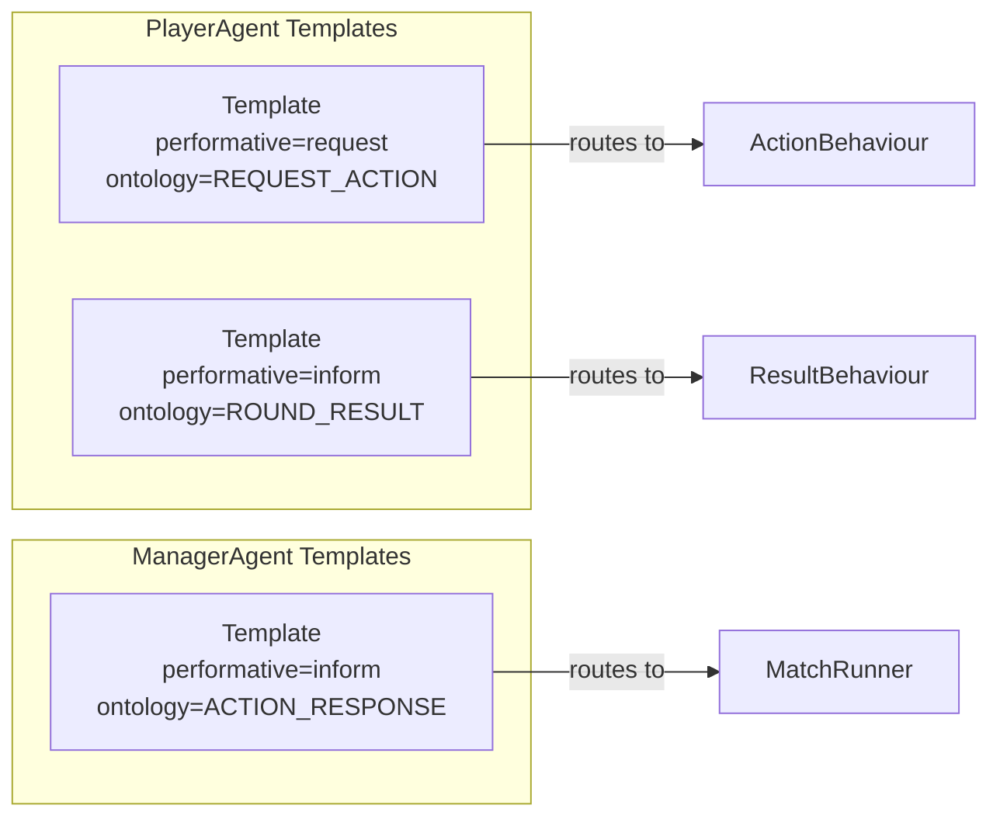
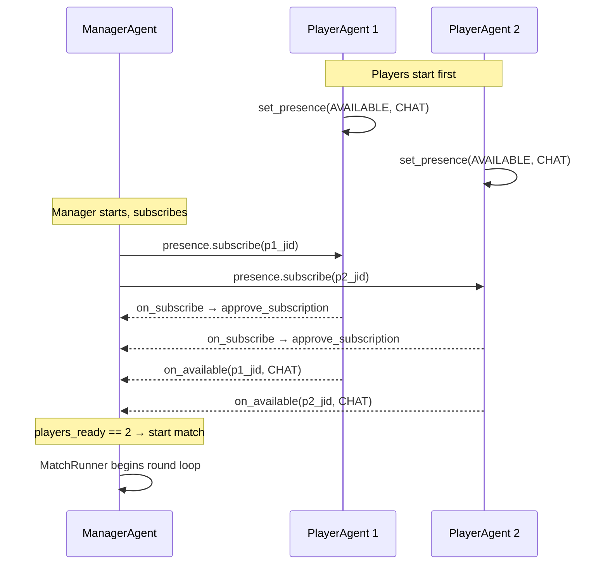

# Implementation Plan: Prisoner's Dilemma MAS (From Scratch)

A clean, from-scratch implementation of the Iterated Prisoner's Dilemma **Tournament** Multi-Agent System using **SPADE 4.x**, fully aligned with all three lab component specifications.

---

## Context & Motivation

Two previous code reviews ([Code_Review.md](file:///Users/bogdanpurdea/Projects/MAS/docs/Code_Review.md), [Second_Code_Review.md](file:///Users/bogdanpurdea/Projects/MAS/docs/Second_Code_Review.md)) identified persistent architectural violations in the existing implementation:

1. **CSV persistence delegated to GUI** — the spec requires the ManagerAgent to write `.CSV` autonomously
2. **Missing aggregated metrics** — cooperation rate, defection rate never computed
3. **Agent autonomy broken** — agents are thread-puppeted by external controllers instead of running as self-contained SPADE entities

This plan builds the system from scratch, eliminating these issues by design.

**Key decisions from user requirements:**
- **Tournament mode is the only mode** — every PlayerAgent plays against every other PlayerAgent using a different strategy. All unique strategy pairs are executed.
- **No human play mode** — fully autonomous agents only.
- **SPADE XMPP server started automatically** — `main.py` launches the built-in SPADE server (`spade run`) as a subprocess before the agents run. No manual setup required.
- **Explicit use of `Template`** for message filtering on receive.
- **Explicit use of SPADE Presence** for agent readiness detection.

---

## SPADE Capabilities Mapping

The following table maps each SPADE feature demonstrated in [SPADE_Experimental](file:///Users/bogdanpurdea/Projects/MAS/SPADE_Experimental) to where it will be used in the new implementation:

| SPADE Capability | Experimental Reference | Usage in New Implementation |
|:---|:---|:---|
| **Agent lifecycle** (`setup`, `start`, `stop`) | [hello.py](file:///Users/bogdanpurdea/Projects/MAS/SPADE_Experimental/quickstart/hello.py), [killdummy.py](file:///Users/bogdanpurdea/Projects/MAS/SPADE_Experimental/quickstart/killdummy.py) | All agents — clean `setup()` / `stop()` lifecycle |
| **OneShotBehaviour** | [send_receive.py](file:///Users/bogdanpurdea/Projects/MAS/SPADE_Experimental/agent_communication/send_receive.py) | `ManagerAgent.MatchRunner` — runs one match to completion |
| **CyclicBehaviour** | [dummy.py](file:///Users/bogdanpurdea/Projects/MAS/SPADE_Experimental/quickstart/dummy.py), [periodic.py](file:///Users/bogdanpurdea/Projects/MAS/SPADE_Experimental/advanced_behaviours/periodic.py) | `PlayerAgent.PlayBehaviour` — listens for action requests continuously |
| **FSMBehaviour** | [finite_state_machine.py](file:///Users/bogdanpurdea/Projects/MAS/SPADE_Experimental/advanced_behaviours/finite_state_machine.py) | Optional: Manager orchestration (Request → Await → Compute → Feedback states) |
| **Message passing** (send/receive) | [send_receive.py](file:///Users/bogdanpurdea/Projects/MAS/SPADE_Experimental/agent_communication/send_receive.py) | Core communication between Manager ↔ Players |
| **`Template` class** (message filtering) | [template.py](file:///Users/bogdanpurdea/Projects/MAS/SPADE_Experimental/agent_communication/template.py) | **PlayerAgent**: separate `Template` per behaviour — one for `REQUEST_ACTION`, one for `ROUND_RESULT`. **ManagerAgent**: `Template` filtering on `ontology=ACTION_RESPONSE` when awaiting player replies |
| **FIPA-ACL metadata** | [send_receive.py](file:///Users/bogdanpurdea/Projects/MAS/SPADE_Experimental/agent_communication/send_receive.py) | `performative` ("request", "inform") + `ontology` on every message |
| **Presence awareness** | [presence.py](file:///Users/bogdanpurdea/Projects/MAS/SPADE_Experimental/presence/presence.py) | **ManagerAgent** subscribes to player JIDs, uses `on_available` callback to track readiness. Match only starts when all players report `AVAILABLE`. **PlayerAgent** sets `PresenceType.AVAILABLE`, `PresenceShow.CHAT` on `setup()` |
| **Web GUI** | [web_gui.py](file:///Users/bogdanpurdea/Projects/MAS/SPADE_Experimental/web_gui/web_gui.py) | ManagerAgent exposes a web dashboard for monitoring |
| **TimeoutBehaviour** | [timeout.py](file:///Users/bogdanpurdea/Projects/MAS/SPADE_Experimental/advanced_behaviours/timeout.py) | Protocol timeout handling — default action on player non-response |
| **Behaviour waiting / join** | [waiting.py](file:///Users/bogdanpurdea/Projects/MAS/SPADE_Experimental/advanced_behaviours/waiting.py) | Main entrypoint awaits `MatchRunner.join()` before teardown |
| **Agent-in-Agent creation** | [agentinagent.py](file:///Users/bogdanpurdea/Projects/MAS/SPADE_Experimental/quickstart/agentinagent.py) | Tournament loop dynamically spawns fresh PlayerAgents per match |
| **Knowledge base** (`agent.set/get`) | [periodic.py](file:///Users/bogdanpurdea/Projects/MAS/SPADE_Experimental/advanced_behaviours/periodic.py) | Store config parameters (receiver JIDs, payoff values) in agent KB |
| **Config management** | [server_config.py](file:///Users/bogdanpurdea/Projects/MAS/SPADE_Experimental/config/server_config.py) | Centralized `config/` package |

---

## Project Structure

```
Software_Project_1/
├── docs/
│   └── implementation_plan.md        ← copy of this plan
├── src/
│   ├── main.py                       ← [NEW] entrypoint — starts SPADE server, runs tournament
│   ├── config/
│   │   ├── __init__.py               ← [NEW] re-exports
│   │   ├── server_config.py          ← [NEW] XMPP_SERVER, PASSWORD
│   │   └── simulation_config.py      ← [NEW] T, R, P, S, rounds, strategies list
│   ├── environment/
│   │   ├── __init__.py               ← [NEW]
│   │   ├── state.py                  ← [NEW] State dataclass (round, scores, history)
│   │   └── environment.py            ← [NEW] PrisonersDilemmaEnvironment
│   ├── strategies/
│   │   ├── __init__.py               ← [NEW] re-exports all strategies + STRATEGY_REGISTRY
│   │   ├── base.py                   ← [NEW] Strategy ABC + Action enum
│   │   └── catalog.py               ← [NEW] all concrete strategies
│   ├── agents/
│   │   ├── __init__.py               ← [NEW]
│   │   ├── manager_agent.py          ← [NEW] ManagerAgent with MatchRunner behaviour
│   │   └── player_agent.py           ← [NEW] PlayerAgent with PlayBehaviour + Template
│   └── persistence/
│       ├── __init__.py               ← [NEW]
│       └── csv_writer.py             ← [NEW] CSV export utility used by ManagerAgent
├── results/                          ← [NEW] output directory for .csv files
└── Lab_MAS_Component_*.pdf           ← existing spec documents
```

> [!IMPORTANT]
> All 14 source files are **new**. The implementation does not modify or depend on any existing code in `MAS_LabProject1`.

---

## Proposed Changes

### Config Package

Centralizes all configuration. Mirrors the pattern from [server_config.py](file:///Users/bogdanpurdea/Projects/MAS/SPADE_Experimental/config/server_config.py).

#### [NEW] `src/config/server_config.py`
```python
XMPP_SERVER = "localhost"
PASSWORD = "your_password"
```

#### [NEW] `src/config/simulation_config.py`
Defines:
- Default payoff values: `T=10, R=5, P=1, S=0`
- Default rounds per match: `1000`
- A `SimulationConfig` dataclass bundling all parameters:
  - `payoff: dict` — `{"T": 10, "R": 5, "P": 1, "S": 0}`
  - `rounds: int`
  - `strategies: list[str]` — names of all strategies participating in the tournament
  - Validation: asserts `T > R > P > S`

---

### Environment Package

Implements the **Environment (E)** from Component 3 Section 1.

#### [NEW] `src/environment/state.py`
A pure data container representing the simulation state:
- `round_number: int`
- `max_rounds: int`
- `scores: dict[str, int]` — cumulative scores per player JID
- `history: list[dict]` — full round-by-round record
- `payoff: dict` — `{T, R, P, S}` values

#### [NEW] `src/environment/environment.py`
The `PrisonersDilemmaEnvironment` class:

| Method | Purpose | Component 3 Mapping |
|:---|:---|:---|
| `__init__(payoff, max_rounds)` | Initialize state | Environment (E) init params |
| `apply_actions(p1_jid, p1_action, p2_jid, p2_action) → dict` | Compute payoffs using the payoff matrix, append to history, increment round | Manager Action |
| `get_percept(player_jid, round_idx) → dict` | Return opponent action + own/opponent payoff for a given round | Player Perception |
| `get_state() → State` | Return current full state snapshot | Manager Perception |
| `get_metrics() → dict` | Compute **aggregated metrics**: cooperation rate, defection rate, avg payoff per player | Component 2 §2.0.1 Output |
| `is_finished() → bool` | `round_number >= max_rounds` | Termination check |

> [!TIP]
> `get_metrics()` directly addresses the "aggregated performance metrics" requirement that was missing in both prior code reviews.

---

### Strategies Package

Implements the **Strategy** interface from Component 3 Figure 2.

#### [NEW] `src/strategies/base.py`
```python
from abc import ABC, abstractmethod
from enum import Enum

class Action(Enum):
    COOPERATE = "C"
    DEFECT = "D"

class Strategy(ABC):
    @abstractmethod
    def decide(self, history: list[dict]) -> Action:
        """Given interaction history, return C or D."""
        ...

    @property
    @abstractmethod
    def name(self) -> str: ...
```

#### [NEW] `src/strategies/catalog.py`
Concrete implementations:

| Strategy | Logic |
|:---|:---|
| `AlwaysCooperate` | Always returns `C` |
| `AlwaysDefect` | Always returns `D` |
| `Random` | 50/50 random choice |
| `TitForTat` | Cooperate first, then mirror opponent's last action |
| `TitForTatWithForgiveness` | TFT but randomly forgives defections (10%) |
| `GrimTrigger` | Cooperate until opponent defects, then always defect |
| `WinStayLoseShift` (Pavlov) | Repeat last action if rewarded (R or T), switch otherwise |
| `SuspiciousTitForTat` | Defect first, then mirror opponent |
| `Adaptive` | Tracks running cooperation ratio, defects if opponent cooperation rate < 50% |

A `STRATEGY_REGISTRY: dict[str, type[Strategy]]` maps string names → classes for config-driven instantiation.

---

### Agents Package

The core MAS implementation. This is where the SPADE framework patterns from `SPADE_Experimental` are applied.

#### [NEW] `src/agents/player_agent.py`

Implements the **Player Agent** from Component 2 §2.0.3 and Component 3.

```
PlayerAgent(Agent)
├── strategy: Strategy              # injected at construction
├── history: list[dict]             # local interaction history
│
├── ActionBehaviour(CyclicBehaviour)    # handles REQUEST_ACTION messages
│   ├── Template: metadata={"ontology": "REQUEST_ACTION"}
│   ├── run()   → strategy.decide(history) → send ACTION_RESPONSE
│   └── on_end()
│
└── ResultBehaviour(CyclicBehaviour)    # handles ROUND_RESULT messages
    ├── Template: metadata={"ontology": "ROUND_RESULT"}
    ├── run()   → parse percept → update history
    └── on_end()
```

**Key design decisions — explicit `Template` usage:**

Each behaviour is registered with its own `Template` instance, following the pattern from [template.py](file:///Users/bogdanpurdea/Projects/MAS/SPADE_Experimental/agent_communication/template.py):

```python
async def setup(self):
    # Template for action requests from Manager
    action_template = Template()
    action_template.set_metadata("performative", "request")
    action_template.set_metadata("ontology", "REQUEST_ACTION")
    self.add_behaviour(self.ActionBehaviour(), action_template)

    # Template for round results from Manager
    result_template = Template()
    result_template.set_metadata("performative", "inform")
    result_template.set_metadata("ontology", "ROUND_RESULT")
    self.add_behaviour(self.ResultBehaviour(), result_template)

    # Presence: announce availability
    self.presence.set_presence(
        presence_type=PresenceType.AVAILABLE,
        show=PresenceShow.CHAT,
        status="Ready to play"
    )
```

This ensures each behaviour **only receives messages matching its template** — `ActionBehaviour` never sees `ROUND_RESULT` messages and vice versa. The `Template` class provides direct FIPA-ACL semantic routing.

**Presence integration:**
- On `setup()`, the player sets its presence to `AVAILABLE` with `PresenceShow.CHAT` (as in [presence.py](file:///Users/bogdanpurdea/Projects/MAS/SPADE_Experimental/presence/presence.py))
- The player also registers `on_subscribe` / `on_subscribed` callbacks to auto-approve presence subscriptions from the Manager

**Message protocol (player side):**
1. `ActionBehaviour` receives `[performative=request, ontology=REQUEST_ACTION]` → calls `strategy.decide(self.history)` → sends `[performative=inform, ontology=ACTION_RESPONSE, body="C"/"D"]`
2. `ResultBehaviour` receives `[performative=inform, ontology=ROUND_RESULT, body="<opponent_action>,<my_payoff>,<opponent_payoff>"]` → parses and appends to `self.history`

#### [NEW] `src/agents/manager_agent.py`

Implements the **Manager Agent** from Component 2 §2.0.3 and Component 3.

```
ManagerAgent(Agent)
├── environment: PrisonersDilemmaEnvironment
├── player_jids: list[str]
├── simulation_config: SimulationConfig
├── players_ready: set                 # tracks presence availability
│
├── MatchRunner(OneShotBehaviour)      # runs the full match loop
│   ├── Template: metadata={"ontology": "ACTION_RESPONSE"}
│   ├── on_start()                     # wait for all players AVAILABLE via presence
│   ├── run()                          # sequential round loop:
│   │   │   for round in range(max_rounds):
│   │   │       1. send REQUEST_ACTION to both players
│   │   │       2. await ACTION_RESPONSE (template-filtered, with timeout)
│   │   │       3. environment.apply_actions()
│   │   │       4. send ROUND_RESULT to both players
│   │   └── after loop: compute metrics
│   └── on_end()                       # persist results via csv_writer, log summary
│
└── setup()
    ├── subscribe to player JIDs via presence
    ├── register on_available callback → track players_ready
    └── add MatchRunner with ACTION_RESPONSE template
```

**Key design decisions — explicit `Template` usage:**

The `MatchRunner` behaviour is registered with a `Template` that filters for `ACTION_RESPONSE` messages:

```python
async def setup(self):
    # Presence: subscribe to all players, track readiness
    self.players_ready = set()

    def on_available(peer_jid, presence_info, last_presence):
        jid_str = str(peer_jid).split("/")[0]
        if jid_str in [str(j) for j in self.player_jids]:
            self.players_ready.add(jid_str)

    self.presence.on_available = on_available
    self.presence.set_presence(
        presence_type=PresenceType.AVAILABLE,
        show=PresenceShow.CHAT,
        status="Manager ready"
    )
    for pjid in self.player_jids:
        self.presence.subscribe(str(pjid))

    # Template for receiving player action responses
    response_template = Template()
    response_template.set_metadata("performative", "inform")
    response_template.set_metadata("ontology", "ACTION_RESPONSE")
    self.match_runner = self.MatchRunner()
    self.add_behaviour(self.match_runner, response_template)
```

**Presence-gated match start:**
Inside `MatchRunner.on_start()`, the Manager polls until `len(self.agent.players_ready) == len(self.agent.player_jids)`, ensuring both players are registered and available before the first round begins. This mirrors the subscription → `on_available` flow in [presence.py](file:///Users/bogdanpurdea/Projects/MAS/SPADE_Experimental/presence/presence.py).

**CSV persistence in `on_end()`:**
```python
async def on_end(self):
    metrics = self.agent.environment.get_metrics()
    history = self.agent.environment.get_state().history
    CSVWriter.write_round_data(
        filepath=f"results/{p1_strategy}_vs_{p2_strategy}.csv",
        history=history,
        metrics=metrics
    )
    print(f"Match complete. Results saved. Final scores: {metrics}")
    await self.agent.stop()
```

This satisfies Component 2 §2.0.3: **"Persist results to .CSV storage"** — the agent itself writes the file.

**Message protocol (manager side):**
1. Send `[performative=request, ontology=REQUEST_ACTION, body="round_<n>"]` to both players
2. Await `[performative=inform, ontology=ACTION_RESPONSE]` from both (template-filtered with timeout)
3. Call `environment.apply_actions(p1_jid, p1_action, p2_jid, p2_action)`
4. Send `[performative=inform, ontology=ROUND_RESULT, body="<opponent_action>,<player_payoff>,<opponent_payoff>"]` to each player

---

### Persistence Package

#### [NEW] `src/persistence/csv_writer.py`

A utility class `CSVWriter`:
- `write_round_data(filepath, history, metrics)` — writes a CSV with columns:
  - `round`, `p1_jid`, `p1_strategy`, `p1_action`, `p2_jid`, `p2_strategy`, `p2_action`, `p1_payoff`, `p2_payoff`, `p1_cumulative`, `p2_cumulative`
- Appends a summary row with aggregated metrics (cooperation_rate_p1, cooperation_rate_p2, total_payoff_p1, total_payoff_p2)
- Used internally by `ManagerAgent.MatchRunner.on_end()` — **the agent writes its own data**

---

### Main Entrypoint

#### [NEW] `src/main.py`

The entrypoint handles three responsibilities:
1. **Start the SPADE XMPP server** as a subprocess
2. **Generate all unique strategy pairings** for the tournament
3. **Execute each match sequentially**, spawning fresh agents per match

```python
import subprocess
import time
import itertools
from uuid import uuid4
import spade
from config.server_config import XMPP_SERVER, PASSWORD
from config.simulation_config import SimulationConfig
from strategies import STRATEGY_REGISTRY
from agents.player_agent import PlayerAgent
from agents.manager_agent import ManagerAgent


def start_spade_server():
    """Launch the built-in SPADE XMPP server as a background subprocess."""
    proc = subprocess.Popen(
        ["spade", "run"],
        stdout=subprocess.DEVNULL,
        stderr=subprocess.DEVNULL,
    )
    time.sleep(3)  # wait for server to initialize
    return proc


async def run_tournament():
    config = SimulationConfig()
    strategy_names = list(STRATEGY_REGISTRY.keys())

    # Generate all unique pairings (each strategy vs every other)
    pairings = list(itertools.combinations(strategy_names, 2))
    print(f"Tournament: {len(pairings)} matches across {len(strategy_names)} strategies")

    for match_idx, (strat_a, strat_b) in enumerate(pairings, 1):
        print(f"\n--- Match {match_idx}/{len(pairings)}: {strat_a} vs {strat_b} ---")

        # Spawn fresh PlayerAgents with unique JIDs
        p1_jid = f"player_{uuid4()}@{XMPP_SERVER}"
        p2_jid = f"player_{uuid4()}@{XMPP_SERVER}"

        player1 = PlayerAgent(p1_jid, PASSWORD, STRATEGY_REGISTRY[strat_a]())
        player2 = PlayerAgent(p2_jid, PASSWORD, STRATEGY_REGISTRY[strat_b]())

        await player1.start(auto_register=True)
        await player2.start(auto_register=True)

        # Spawn ManagerAgent for this match
        mgr_jid = f"manager_{uuid4()}@{XMPP_SERVER}"
        manager = ManagerAgent(
            mgr_jid, PASSWORD, config,
            player_jids=[p1_jid, p2_jid],
            strategy_names=[strat_a, strat_b]
        )
        await manager.start(auto_register=True)

        # Wait for match to finish (MatchRunner.on_end() writes CSV)
        await manager.match_runner.join()

        # Teardown
        await player1.stop()
        await player2.stop()
        await manager.stop()

    print(f"\nTournament complete. Results written to results/ directory.")


if __name__ == "__main__":
    server_proc = start_spade_server()
    try:
        spade.run(run_tournament())
    finally:
        server_proc.terminate()
        server_proc.wait()
```

> [!NOTE]
> The SPADE XMPP server is started automatically via `subprocess.Popen(["spade", "run"])` and terminated cleanly in a `finally` block. No manual server startup is needed.

---

## Component 3 Compliance Checklist

| Component 3 Requirement | Implementation |
|:---|:---|
| **Environment (E)** — state defined by init params, round, scores | `environment/state.py` + `environment/environment.py` |
| **Manager Perception** — current state + player actions | `MatchRunner.run()` receives actions via XMPP (template-filtered) |
| **Manager Action** — requests, results, summaries | FIPA-ACL messages with `REQUEST_ACTION`, `ROUND_RESULT` ontologies |
| **Manager Goal** — init matches, synchronize, compute, persist | `MatchRunner` loop + `on_end()` CSV write |
| **Player Perception** — action requests + history | `ActionBehaviour` + `ResultBehaviour` with separate `Template` instances |
| **Player Action** — Cooperate or Defect | `strategy.decide(history)` → `ACTION_RESPONSE` message |
| **Player Goal** — execute strategy, maintain history | `deliberate_cycle()` in `ActionBehaviour` |
| **Accessible** environment | Manager has full access to `Environment` instance |
| **Deterministic** | `apply_actions()` produces exactly one outcome per input pair |
| **Episodic** | No cross-match evaluation; all aggregation is post-match |
| **Static** | State changes only via `apply_actions()` |
| **Discrete** | Finite rounds, `Action ∈ {C, D}` |
| **Markovian** | State carries cumulative history; agents decide from current state |
| **PAGES class diagram** | `ManagerAgent` → `Environment` → `State`; `PlayerAgent` → `Strategy` |
| **SPADE class diagram** | Both inherit `spade.agent.Agent`; behaviours are `OneShotBehaviour` / `CyclicBehaviour` |
| **Interaction model** | 4-step protocol: Request → Response → Computation → Feedback |

---

## Template Usage Summary

The `Template` class from `spade.template` is used in three places to ensure correct message routing:



| Agent | Behaviour | Template Filter | Purpose |
|:---|:---|:---|:---|
| PlayerAgent | `ActionBehaviour` | `performative=request`, `ontology=REQUEST_ACTION` | Only receives action requests from Manager |
| PlayerAgent | `ResultBehaviour` | `performative=inform`, `ontology=ROUND_RESULT` | Only receives round results from Manager |
| ManagerAgent | `MatchRunner` | `performative=inform`, `ontology=ACTION_RESPONSE` | Only receives action responses from Players |

---

## Presence Usage Summary

Drawing directly from the pattern in [presence.py](file:///Users/bogdanpurdea/Projects/MAS/SPADE_Experimental/presence/presence.py):



---

## Build Order (Phased)

### Phase 1 — Foundation (no SPADE needed)
1. `config/server_config.py` + `config/simulation_config.py`
2. `strategies/base.py` + `strategies/catalog.py`
3. `environment/state.py` + `environment/environment.py`
4. `persistence/csv_writer.py`

### Phase 2 — Agents (SPADE required)
5. `agents/player_agent.py` — with `ActionBehaviour` + `ResultBehaviour` + `Template` + Presence
6. `agents/manager_agent.py` — with `MatchRunner` + `Template` + Presence + CSV persistence

### Phase 3 — Tournament Integration
7. `main.py` — SPADE server subprocess + tournament loop over all `itertools.combinations`
8. Web GUI startup on ManagerAgent

### Phase 4 — Verification
9. Unit tests for Environment, Strategies, CSVWriter
10. Full tournament integration test

---

## Verification Plan

### Automated Tests
- **Unit tests** for `Environment.apply_actions()` — verify payoff matrix correctness for all 4 action pairs (CC→R,R; CD→S,T; DC→T,S; DD→P,P)
- **Unit tests** for each `Strategy.decide()` — verify expected behavior given mock history
- **Unit tests** for `CSVWriter` — verify output format and metrics row
- **Integration test**: Run a 10-round match with `AlwaysCooperate` vs `AlwaysDefect`, verify:
  - Final scores: AC gets `0×10 = 0` (all S=0), AD gets `10×10 = 100` (all T=10)
  - CSV file exists and contains 10 data rows + summary
  - Cooperation rate for AC = 100%, for AD = 0%

### Manual Verification
- Run a full tournament with all 9 strategies (36 matches) × 1000 rounds per match
- Verify CSV output in `results/` directory — one file per match
- Check Manager web GUI at `http://127.0.0.1:10000/spade` shows agent state
- Compare results against known game theory expectations (TitForTat should perform well in iterated PD)
